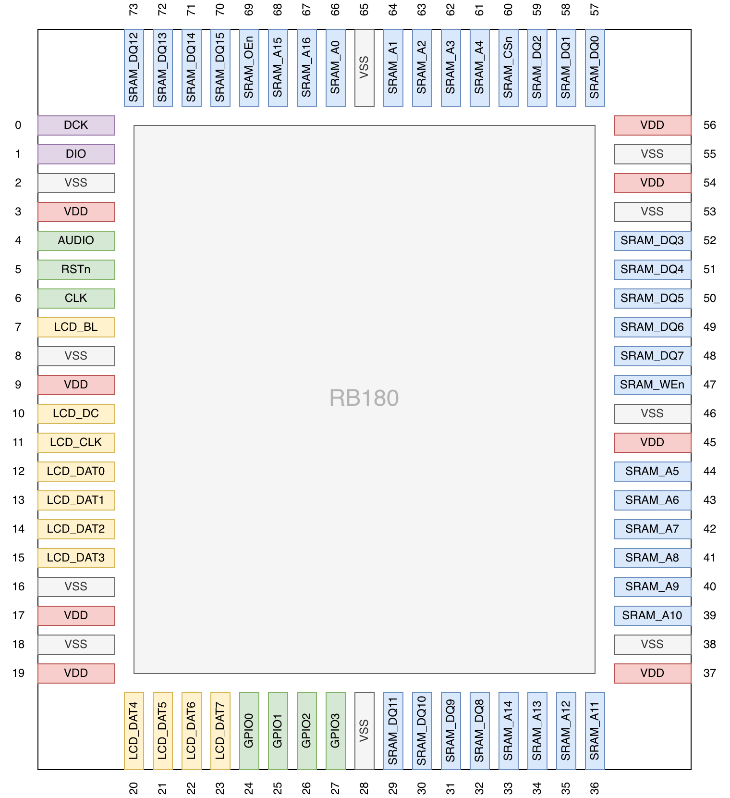

:sectnums:
:toc:
:toclevels: 3
:doctype: book
:pdf-theme: pdf-theme.yml
ifdef::HTMLBUILD[]
:data-uri:
:toc: left
endif::[]
:times: ×

= RB180

== Introduction

RB180 is a single-chip games console taped out on the cutting-edge GF180MCU planar CMOS process. This process features both thick and thicker oxide, and operates in the _alarmingly high_ core voltage regime. RB180 features:

* 5V single-supply operation at up to 25 MHz (post-PnR STA, slow corner).
* Asymmetric dual 32-bit https://github.com/wren6991/hazard3[Hazard3] RISC-V processors (CPU and APU):
** Identical processor configurations with asymmetric bus connectivity and responsibilities.
** Single-cycle 32-bit multiply.
** Modern ISA support: the first public tapeout of the Zilsd and Zclsd extensions.
* RISC-V SMP debug and virtual UART channels exposed through a two-wire https://github.com/Wren6991/TwoWireDebug[TWD] serial debug interface.
* Programmable 2D graphics hardware (PPU) from the https://github.com/wren6991/riscboy[RISCBoy] project, including support for affine-transformed sprites and tiled backgrounds.
* Video output to standard LCD controllers using SPI or advanced quad and "octal serial" (8080).
* Over 12 kB internal SRAM:
** 8 kB CPU RAM (32-bit wide).
** 4 kB APU RAM (32-bit wide).
** Internal scanline and palette memories for the PPU (various widths).
* Up to 256 kB external parallel SRAM (16-bit wide) with single-cycle access from PPU and CPU.
* Auxiliary digital peripherals:
** Streaming SPI read peripheral.
** Standard RISC-V platform timer.
** Custom timers for APU audio sequencing.
** Mono audio output pipeline with fixed upsampling and output dithering (48 kSa/s 16-bit -> 1.5 MSa/s 4-bit PWM).
** Hardware UART.
* Minimal sea-of-gates bootrom: loads and checksums a second stage from external SPI flash.

<<<

=== Padout

[cols="20,~", options="header"]
|===
| Group | Description
| VSS | Ground connections (common digital + IO ground)
| VDD | Positive supply connections (common digital + IO supply)
| DIO/DCK | Two-wire debug interface (RISC-V debug and VUARTs)
| AUDIO | 1.5 MHz PWM audio output or spare GPIO
| RSTn | Active-low asynchronous global reset
| CLK | Root clock input
| LCD_BL | LCD backlight PWM
| LCD_DC | LCD interface Data/nCommand register select
| LCD_CLK | LCD data strobe
| LCD_DATx | LCD data bus (up to 8 bits), spare GPIO, or hardware UART (DAT3=TX, DAT2=RX)
| GPIOx | Spare GPIO or streaming SPI (GPIO0=MOSI, GPIO1=SCK, GPIO2=CSn, GPIO3=MISO)
| SRAM_DQx | Asynchronous SRAM 16-bit bidirectional data bus
| SRAM_Ax | Asynchronous SRAM 17-bit address bus
| SRAM_OEn | Asynchronous SRAM active-low output enable
| SRAM_WEn | Asynchronous SRAM active-low write enable
| SRAM_CSn | Asynchronous SRAM active-low chip enable
|===

NOTE: The SRAM interface does not support byte strobes, to minimise the pin count. Instead, byte reads are implemented as halfword reads, and byte writes are implemented as halfword read-modify-write sequences (two cycles per write).

[[riscv-isa-support]]
=== RISC-V ISA support

The CPU and APU are near-identical https://github.com/wren6991/hazard3[Hazard3] instances. They each implement the following RISC-V ISA and extensions:

* RV32I base ISA
* M integer multiply/divide/modulo
* C compressed instructions (Zca)
* Zba address generation
* Zbb basic bit manipulation
* Zbkb basic bit manipulation for scalar cryptography
* Zbs single-bit manipulation
* Zcb additional compressed instructions
* Zclsd compressed load/store pair
* Zifencei instruction fence
* Zilsd load/store pair
* Standard M-mode CSRs (priv v1.12)
* M-mode and Debug mode

Read the https://wren.wtf/hazard3/doc/#reg-h3.misa[h3.misa] CSR to confirm the ISA configuration. You can access this register from the debugger or from on-target M-mode software.

The branch predictor and single-cycle 32-bit multiplier are also enabled on both cores. Divide, modulo and high-half multiply execute at one bit per cycle.

The A extension (atomics) is a notable omission. The utility would be limited as CPU and APU have vastly different bus connectivity. The APU is expected to spend most of its time dealing with hard-real-time audio tasks, so blocking on lock acquisition is undesirable. Software interrupts allow simple IPC message passing through mailboxes in APU RAM.

==== Arch Strings

Use these strings to configure your toolchain for optimal RISC-V ISA support. For best results, build a fresh standard library using the same ISA variant. Follow instructions in the https://github.com/wren6991/hazard3#risc-v-toolchain[Hazard3 README] for building a RISC-V toolchain on Linux or MacOS.

The full ISA string is: `-march=rv32im_zba_zbb_zbkb_zbs_zca_zcb_zclsd_zicsr_zifencei_zilsd`.

A sensible baseline for older, pre-packaged toolchains is: `-march=rv32imc_zicsr_zifencei`.
